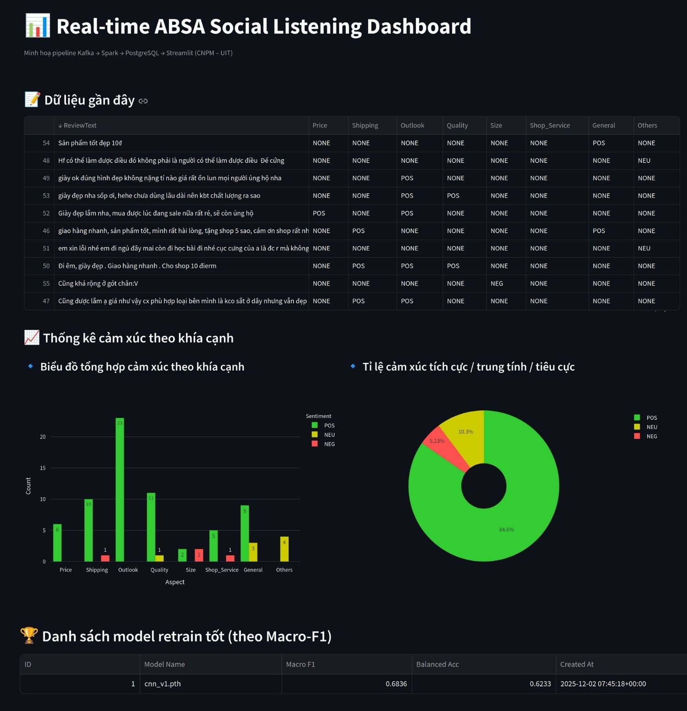

# ABSA Streaming Pipeline (Vietnamese Shopee Reviews)

This project implements an end-to-end real-time **Aspect-Based Sentiment Analysis (ABSA)** pipeline for Vietnamese e-commerce reviews.
It is built on a full data engineering + MLOps stack: **Kafka → Spark Structured Streaming → PostgreSQL → Airflow → Streamlit**.

The goal is to simulate a real social-listening workflow where customer comments flow into Kafka, are processed by a custom CNN model, stored in a database, and displayed on a live dashboard.

## 1. Overview

This pipeline processes Shopee review data in near real-time.
It includes:

* A **Kafka producer** that streams Vietnamese reviews from CSV
* A **Spark Structured Streaming consumer** that runs CNN inference (8 aspects) using Pandas UDFs
* A **PostgreSQL** database storing sentiment predictions
* A **Streamlit dashboard** that updates every few seconds
* A full **Airflow management** layer for running ingestion, processing, monitoring, cleanup, and model retraining
* A custom **TextCNN model** trained manually from scratch (PyTorch)

The project is fully containerized with Docker and can be run locally.

## 2. Architecture

Airflow

DAG 1: CSV → Kafka → Spark Structured Streaming → PostgreSQL → Streamlit Dashboard

DAG 2: Preprocess → Train CNN → Evaluate → Promote Model → PostgreSQL → Streamlit Dashboard

### Source Code

- **Main Streaming DAG**
  [`absa_streaming_lifecycle_dag.py`](../../dags/absa_streaming_lifecycle_dag.py)

  Producer
  [`producer.py`](scripts/producer.py)

  Consumer
  [`consumer_postgres_streaming.py`](scripts/consumer_postgres_streaming.py)

- **Retraining DAG**
  [`retrain_dag.py`](../../dags/retrain_dag.py)

  Preprocessing
  [`preprocess.py`](scripts/preprocess.py)

  Training
  [`train.py`](scripts/train.py)

  Evaluation
  [`eval.py`](scripts/eval.py)

  Save to Postgres
  [`save_postgres.py`](scripts/save_postgres.py)

* **Streamlit Dashboard**
  [`streamlit_app.py`](streamlit/streamlit_app.py)

* **CNN Training Notebook**
  [`cnn_training.ipynb`](../../../notebooks/cnn_training.ipynb)

## 3. Features

### Real-Time Processing

* Streams Vietnamese reviews into Kafka (producer)

* Spark consumer performs:

  * Tokenization + preprocessing
  * Vocabulary mapping
  * Batch inference using Pandas UDFs
  * Prediction for 8 aspects
  * Writes results to PostgreSQL

### Custom CNN Model (PyTorch)

* TextCNN built manually (no external sentiment libraries)
* Multi-head architecture: one head per aspect
* Early stopping, best model saving

### Automated Model Retraining

* Runs preprocessing → training → evaluation
* Writes performance metrics (Macro-F1, Balanced Accuracy) into PostgreSQL
* Compares the new model vs previous versions
* Automatically promotes the best model

### Managing with Airflow

[Main DAG:](https://github.com/ThSonDev/airflow-data-pipelines/blob/main/airflow/dags/absa_streaming_lifecycle_dag.py)

* Run producer
* Run Spark consumer
* Monitor checkpoints
* Cleanup
* Timeouts, retries, fail-safe logic

[Retraining DAG:](https://github.com/ThSonDev/airflow-data-pipelines/blob/main/airflow/dags/retrain_dag.py)

* Preprocess data → train CNN → evaluate → update metrics → promote model

### Live Dashboard

[The dashboard (Streamlit):](https://github.com/ThSonDev/airflow-data-pipelines/blob/main/airflow/projects/absa_streaming/streamlit/streamlit_app.py)

* Shows predictions
* Displays aspect-level sentiment charts
* Shows global sentiment distributions
* Lists retraining results sorted by Macro-F1
* Auto-refreshes every 5 seconds



## 4. Project Structure

```
airflow/
│── dags/
│     ├── absa_streaming_lifecycle_dag.py
│     └── retrain_dag.py
│── models/
│     ├── cnn_best.pth
│     └── vocab.json
│── projects/absa_streaming/
│     ├── scripts/
│     │     ├── producer.py
│     │     ├── consumer_postgres_streaming.py
│     │     ├── preprocess.py
│     │     ├── train.py
│     │     ├── eval.py
│     │     └── save_postgres.py
│     ├── streamlit/streamlit_app.py
│     ├── data/
│     │     ├── test_data.csv
│     │     ├── train_data.csv
│     │     ├── val_data.csv
